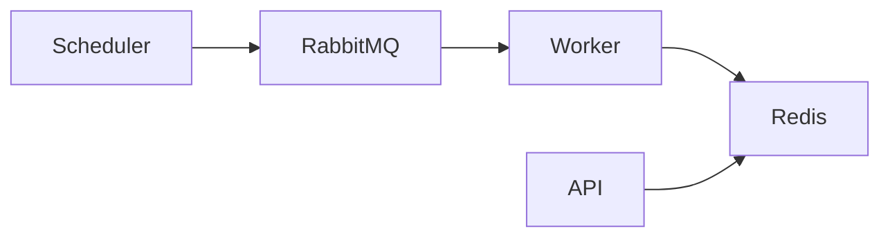

# hacker.news.lab


High-performance and scalable API to retrieve the top N best stories from Hacker News.

---

## 🚀 Overview

Production-ready architecture focused on:
- Low latency
- High throughput
- Fault tolerance
- Observability

---

## 🏗️ Architecture



---

## 🔌 API

GET /api/v1/stories/best?n=10

---

## ⚙️ Running

```bash
docker-compose up --build
```

---

## 📊 Observability

| Tool       | URL |
|------------|-----|
| Prometheus | http://localhost:9090 |
| Grafana    | http://localhost:3000 |
| Jaeger     | http://localhost:16686 |

---

## 📈 Prometheus Queries (Examples)

### 🔹 API Request Rate
```promql
rate(http_server_requests_seconds_count[1m])
```

---

### 🔹 API Latency (avg)
```promql
rate(http_server_requests_seconds_sum[1m]) 
/
rate(http_server_requests_seconds_count[1m])
```

---

### 🔹 Error Rate (5xx)
```promql
rate(http_server_requests_seconds_count{status_code=~"5.."}[1m])
```

---

### 🔹 Worker Processed Stories
```promql
rate(stories_processed[1m])
```

---

### 🔹 Worker Errors
```promql
rate(worker_errors[1m])
```

---

### 🔹 CPU Usage
```promql
process_cpu_seconds_total
```

---

### 🔹 Memory Usage
```promql
process_resident_memory_bytes
```

---

### 🔹 .NET GC Collections
```promql
dotnet_gc_collection_count_total
```

---

## 🧠 Architecture Decisions

- Snapshot for consistency
- Redis for fast reads
- Queue for decoupling

---

## 🔐 Resilience

- Retry
- Circuit breaker
- Timeout
- Fallback snapshot

---

## 🛠️ Stack

- .NET 9
- Redis
- RabbitMQ
- OpenTelemetry
- Prometheus
- Grafana
- Jaeger
- Docker

---

## 📄 License

MIT
