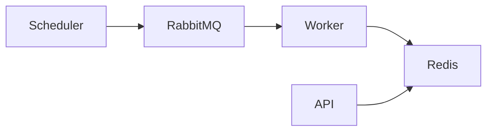

# hacker.news.lab


High-performance and scalable API to retrieve the top N best stories from Hacker News.

---

## 🚀 Overview

Production-ready architecture focused on:
- Low latency
- High throughput
- Fault tolerance
- Observability

---

## 🏗️ Architecture



---

## 🔌 API

### Base URL

```text
http://localhost:5000
```

---

### Load Cache / Refresh Snapshot

Before running the first query for best stories, you must trigger the cache loading process.

This endpoint publishes a refresh event that will be processed by the worker.  
The worker fetches Hacker News data, builds the snapshot and stores it in Redis.

```http
POST http://localhost:5000/api/v1/stories/best/refresh
```

Example using curl:

```bash
curl -X POST http://localhost:5000/api/v1/stories/best/refresh
```

> The first request to retrieve stories should be executed only after the worker finishes processing and the Redis snapshot is available.

---

### Get Best Stories

```http
GET http://localhost:5000/api/v1/stories/best?n=10
```

Example using curl:

```bash
curl "http://localhost:5000/api/v1/stories/best?n=10"
```

---

## ⚙️ Running

```bash
docker-compose up --build
```

---

## ✅ Suggested Execution Flow

1. Start the containers:

```bash
docker-compose up --build
```

2. Trigger cache/snapshot loading:

```bash
curl -X POST http://localhost:5000/api/v1/stories/best/refresh
```

3. Wait for the worker to finish processing.

4. Query the API:

```bash
curl "http://localhost:5000/api/v1/stories/best?n=10"
```

---

## 📊 Observability

| Tool       | URL |
|------------|-----|
| API        | http://localhost:5000 |
| Prometheus | http://localhost:9090 |
| Grafana    | http://localhost:3000 |
| Jaeger     | http://localhost:16686 |

---

## 📈 Prometheus Queries Examples

### Worker Processed Stories

```promql
stories_processed_total
```

---

## 🧠 Architecture Decisions

### Snapshot Strategy

The API never reads partially processed data.

The worker creates a temporary snapshot, validates it and then atomically switches the active snapshot pointer.

### Cache Strategy

The system stores the full ordered list and derives any top N result using slicing.

### Queue-based Processing

RabbitMQ decouples the API from the heavy data processing workload.

---

## 🔐 Resilience

- Retry
- Circuit breaker
- Timeout
- Fallback snapshot

---

## 🛠️ Stack

- .NET 9
- ASP.NET Core Minimal API
- Worker Service
- Redis
- RabbitMQ
- OpenTelemetry
- Prometheus
- Grafana
- Jaeger
- Docker / Docker Compose

---